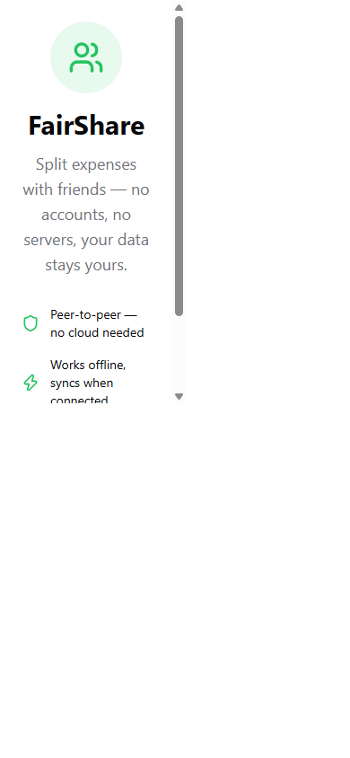
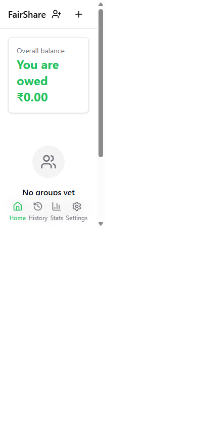
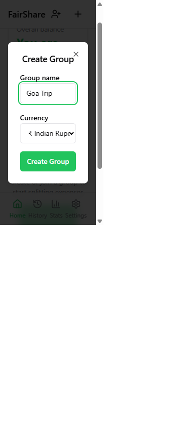
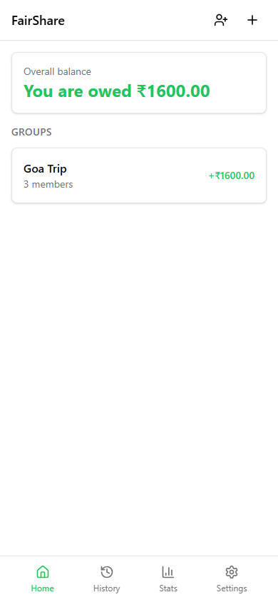
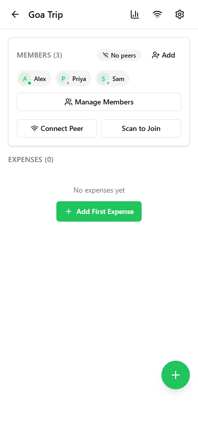
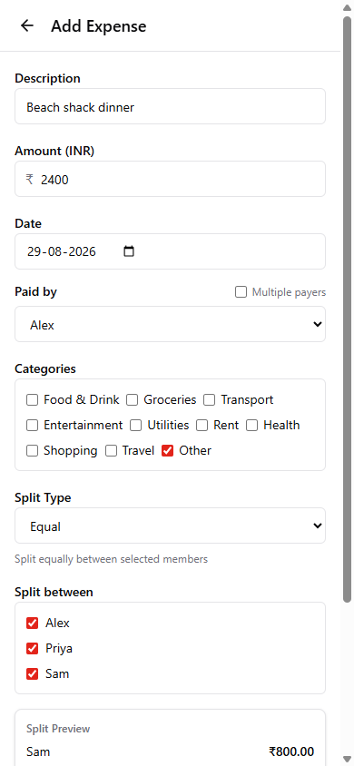
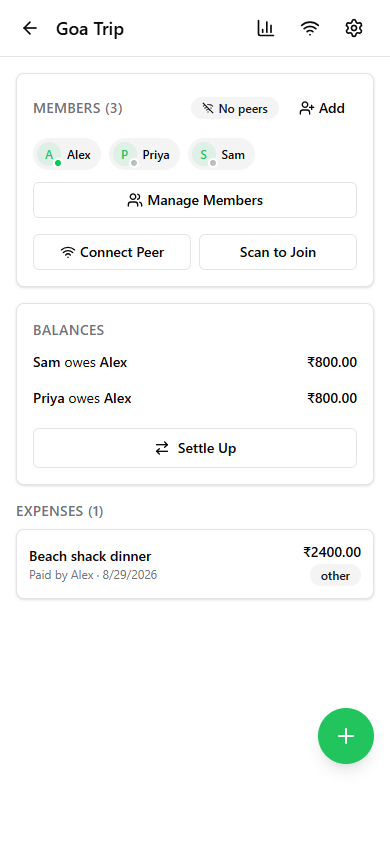
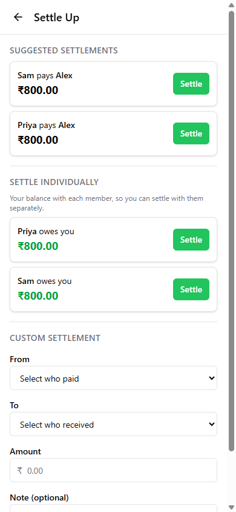
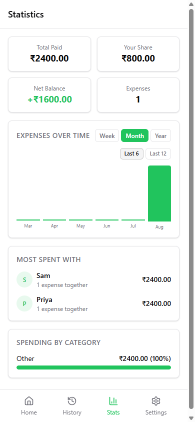
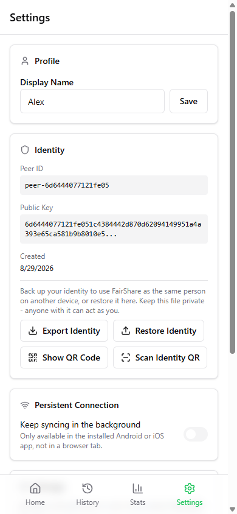

# FairShare: User Guide

## What is FairShare?

FairShare is a private, serverless expense-splitting app. Track shared costs with friends, roommates, or travel companions with no accounts, no cloud, and no subscriptions. Your data stays on your device and syncs directly with your friends' devices.

---

## System Requirements

### Android
- **Minimum OS version**: Android 7.0 (API 24) or newer
- **Android System WebView**: must be kept up to date via Play Store. FairShare's peer-to-peer connection relies on WebRTC support in the device's WebView, and very old/stale builds (version ~68 from 2018 has been observed in the wild) fail to gather network candidates at all, causing "Connection timed out" errors during peer setup even though the app itself installs and runs fine.
  - Check for updates: Play Store → search "Android System WebView" → Update if available
  - If no update is offered, enable Developer Options (Settings → About phone → tap "Build number" 7 times) → Developer Options → **WebView implementation** → switch to "Chrome" if a modern Chrome browser is installed
  - Recommended: WebView/Chrome version 90 or newer for reliable P2P connections

### Desktop / Other Browsers
- Any modern browser with WebRTC support: Chrome, Firefox, Safari 15+, Edge

### iOS
- iOS 15+ recommended (WebKit's built-in WebRTC support)

---

## Getting Started

### First Launch

When you open FairShare for the first time, you'll be asked to enter a display name. This is how others will see you in shared groups. A unique device identity is generated automatically (no email or password needed).

Once you're set up, the Dashboard starts empty until you create or join a group:

### Creating a Group

1. From the Dashboard, tap **"Create Group"**
2. Enter a group name (e.g., "Trip to Paris", "Apartment")
3. Choose a default currency
4. You're added as the first member automatically

Once created, the group appears on your Dashboard along with your overall balance across all groups:

### Adding Members

In any group, tap **"Add"** next to the Members heading:
- Enter the person's name
- They'll appear as a member immediately
- They can later connect their own device to sync (see Connecting Devices below)

> **Note:** a manually-added member is just a name placeholder with no device of its own. If
> that person later connects their own device (via the QR flow), the app currently has no way
> to recognize "this is the same person". It adds them as a **second, separate member**
> instead of merging into the placeholder, since the placeholder was never a real identity to
> begin with. If you know someone will connect their own device, it's cleaner to let them join
> via QR directly rather than adding them manually first.

---

## Core Features

### Adding an Expense

1. Open a group and tap the **+** button (bottom right)
2. Fill in:
   - **Description**: What was the expense for
   - **Amount**: Total cost
   - **Category**: Food, transport, accommodation, etc.
   - **Paid by**: Who paid
   - **Split between**: Select which members share this cost
   - **Split type**: How to divide it (see Split Types below)
3. Tap **"Add Expense"**

### Split Types

| Type | How it works | Best for |
|------|-------------|----------|
| **Equal** | Divides evenly among selected members | Most situations |
| **Exact** | You enter the exact amount each person owes | Restaurant bills where everyone ordered differently |
| **Percentage** | Each person pays a percentage of the total | Income-proportional splits |
| **Shares** | Each person gets a number of shares (e.g., a couple gets 2 shares) | Families or couples sharing with singles |

### Viewing Balances

The group page shows a **Balances** section with simplified debts:
- "Alice owes Bob Rs.25.00" means one direct payment settles them
- The app automatically simplifies complex debts (A owes B who owes C becomes A owes C directly)

### Settling Up

1. In a group, tap **"Settle Up"**
2. Choose a suggested settlement or enter a custom amount
3. Record who paid whom and how much
4. The balance updates immediately

### Deleting a Group

1. Open the group
2. Tap the **gear icon** (top right) to open Settings
3. Scroll down and tap **"Delete Group"**
4. Confirm the deletion
5. The group and all its expenses are permanently removed

---

## Connecting Devices (P2P Sync)

FairShare syncs directly between devices with no server involved. Two devices connect by exchanging QR codes (or text blobs) one time. After that, they sync automatically whenever both are online.

### Connecting to a Friend (You Initiate)

1. Open a group, tap **"Connect Peer"** or the Wifi icon in the header
2. Wait ~3 seconds while your device prepares connection info
3. A QR code and text blob appear. Show or send this to your friend
4. Tap **"I've shared it: scan their response"**
5. Scan your friend's response QR code (or paste their text)
6. Connected! Data syncs automatically

### Joining a Friend (They Initiated)

1. Open the same group, tap **"Scan to Join"**
2. Scan your friend's QR code (or tap "Paste code instead" and paste their text)
3. Wait ~3 seconds while your device prepares a response
4. Show your response QR code back to your friend (or send the text)
5. Once they scan it, you're connected!

### Connection Status

The **peer badge** next to the Members heading shows:
- "No peers": not connected to anyone
- "1 peer" / "2 peers": actively connected and syncing

### When Connection Fails

If devices can't connect directly (common on mobile data or corporate networks):
- Try connecting while both devices are on the **same WiFi network**
- Use the **copy/paste** method if QR scanning is difficult
- Connection works best on home WiFi networks

---

## Statistics

The **Stats** tab shows:
- **Total Paid**: Everything you've paid across all groups
- **Your Share**: Your fair share of all group expenses
- **Net Balance**: Whether you're owed money or owe others overall
- **Most Spent With**: Top 5 people you share the most expenses with, ranked by total amount
- **Spending by Category**: Breakdown of where money goes (food, transport, etc.)

> **Note on multiple currencies:** these personal totals add up raw amounts across every group
> you're in, without currency conversion. If all your groups use the same currency this is fine;
> if you're in groups with different currencies (e.g. one USD, one INR), the combined totals mix
> them together as if they were the same unit. Treat this page as approximate in that case.
> Per-group figures (inside each group, and each group's own Stats page) are always correct and
> shown in that group's actual currency.

---

## Settings

### Group Settings (gear icon in group)
- **Default Currency**: Change the group's currency (USD, EUR, GBP, INR, JPY, CAD, AUD)
- **Default Split Type**: Set whether new expenses default to equal, exact, percentage, or shares
- **Simplify Debts**: When enabled, complex chains of debts are reduced to fewer direct payments
- **Backup & Export**: Export the group as JSON (all expenses, members, and settings; can be
  re-imported here or on another device) or as CSV (expenses only, for spreadsheets). Import a
  previously exported JSON file to restore or merge a group.
- **Delete Group**: Permanently remove the group and all its data

### App Settings (Settings tab)
- **Display Name**: Change how others see you
- **Identity**: Your unique device ID and public key (for debugging)
- **Backing up your identity**: Your identity (display name + keypair) is what lets other
  devices recognize you across groups. Back it up so you can move to a new device or restore
  after reinstalling:
  - **Export Identity**: downloads a JSON file (keep it private, anyone with it can act as you)
  - **Restore Identity**: replaces your current on-device identity with one from a JSON file
  - **Show QR Code** / **Scan Identity QR**: transfer an identity directly between two devices
    without a file, e.g. moving to a new phone. Both directions show a warning first since the
    QR contains your private key.
- **Persistent Connection**: A toggle to help FairShare keep syncing while backgrounded or the
  screen is locked.
  - **Android**: shows an ongoing notification and keeps the app connected to peers continuously
    while backgrounded/locked.
  - **iOS**: Apple does not allow apps to run continuously in the background, so this only gives
    an in-progress sync a few extra seconds to finish before the connection is suspended. It is
    not a substitute for opening the app to sync.
  - **Browser (not installed as an app)**: unavailable; install the Android or iOS app to use it.

---

## How Data Works

### Privacy
- All data is stored **only on your device** (in the browser's IndexedDB)
- Sync happens **directly between devices** (peer-to-peer WebRTC)
- No data ever touches a server
- No analytics, no tracking, no accounts
- To find a route between two phones, the app asks public STUN servers (Cloudflare, Google and
  Twilio by default) what your public IP address is. Those servers see your IP and that you're
  using WebRTC, nothing about your groups or expenses.

### Persistence
- Data persists across browser sessions (stored in IndexedDB)
- Closing the tab does NOT delete your data
- Clearing browser data WILL delete your data
- Install as a PWA (Add to Home Screen) for the most app-like experience

### Sync Behavior
- Changes sync in real-time when peers are connected
- If you add an expense while offline, it syncs next time you connect
- Multiple tabs on the same device sync instantly via BroadcastChannel

---

## Tips

- **Install as PWA**: On mobile, use "Add to Home Screen" for fullscreen mode and faster loading
- **Use copy/paste for remote friends**: If you can't scan QR codes in person, copy the connection text and send it via any messaging app
- **One group per trip/context**: Create separate groups for different purposes (one for a trip, one for roommates, one for a dinner)
- **Settle regularly**: Record settlements as you make them to keep balances accurate
- **Reconnecting**: if both devices stay on the same network without the app being fully closed
  (e.g. phone screen locks, brief WiFi drop), the connection resumes automatically. Once the
  connection actually drops for good (app closed a while, network changed, other device restarted),
  WebRTC's session credentials expire and there's no way to silently revive it. You will need to
  redo the QR/text exchange once. There's no persistent pairing that survives that.

---

## FAQ

**Q: What happens if I lose my phone?**
A: Your data is on that device only. If another connected peer has synced with you, they'll still have the shared group data. There's no cloud backup currently.

**Q: Can I use this on desktop and mobile?**
A: Yes! Open the app in any modern browser. Connect your devices using the QR code flow to keep them in sync.

**Q: Do both devices need to be online at the same time?**
A: For syncing, yes: WebRTC requires both devices to be online simultaneously. Changes made offline will sync next time both are connected.

**Q: Is there a limit to group size?**
A: No hard limit, but the app is optimized for small groups (2-15 people). Very large groups may experience slower sync.

**Q: Can I export my data?**
A: Yes. Open a group's Settings (gear icon) and use **Export JSON** (full backup, re-importable)
or **Export CSV** (expenses only, for spreadsheets). Your identity itself can also be backed up
separately from the app Settings tab (see "Backing up your identity" above).

**Q: What browsers are supported?**
A: Any modern browser with WebRTC support: Chrome, Firefox, Safari 15+, Edge. Works on both desktop and mobile.
